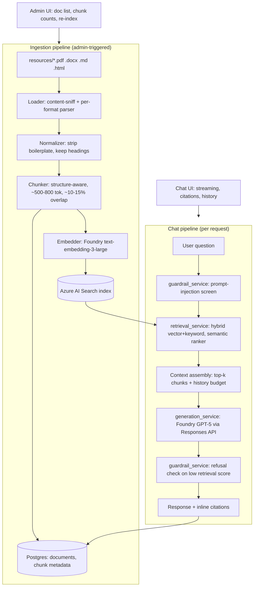
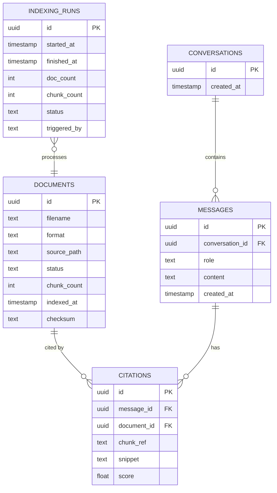

# UC1 — RAG Knowledge Chatbot: Solution Design Doc

## 1. Problem statement

Employees need quick, trustworthy answers to policy/benefits/procedure questions without
digging through a stack of PDFs, DOCX files, and wiki pages. Today those answers live
scattered across 24 source documents in 4 formats. This project builds an internal knowledge
assistant that answers questions **grounded only in that corpus** — with citations back to
the source document and section, a refusal path for out-of-scope questions, and resistance to
prompt-injection attempts — so employees get a fast, accurate, auditable answer instead of an
LLM improvising from general knowledge.

## 2. Corpus

**24 documents, `uc1-RAG-Knowledge-Chatbot/backend/resources/` — a generated fictional "Contoso
Corp" policy set** (per the brief's own alternative to collecting real-world documents),
evenly split 6 PDF / 6 DOCX / 6 HTML / 6 Markdown, 222 chunks total (avg 105 tokens/chunk).
Every file follows a `CON-<DEPT>-<NNN>_<Topic>` naming convention (`CON-HR-002_PTO_Leave_Policy.pdf`,
`CON-IT-002_Incident_Response_Policy.html`, etc.) spanning HR, IT, Finance, and Ops — 24
distinct topics with no overlap. Started as 20 documents (5/5/5/5); 4 more
(`CON-FIN-003_Delegation_of_Authority.md`, `CON-HR-014_Disciplinary_Action_Policy.pdf`,
`CON-HR-015_Whistleblower_Policy.html`, `CON-OPS-002_Health_Safety_Policy.docx`) were added
2026-07-22, one per format, keeping the even split intact.

**Why fictional over real-world-scraped, decided after real experience with both (2026-07-21):**
the corpus started as a 19-document patchwork of real, publicly-available HR templates and
government guides. Two real, costly problems came out of that approach, both caught only by
actually testing against the live index, not by reading the files:

- **Off-topic content dominating the index.** A retirement question surfaced a citation from a
  federal hiring-examiner procedures manual that had no business in an HR-policy corpus. A full
  content audit (every file opened and read, not trusted by filename) found two such documents
  making up **58% of the entire chunk index** — an accuracy problem, not just a naming one.
- **Wildly uneven document sizes.** The largest single document (`hr-manual.docx`, 132 chunks,
  32% of the corpus) dominated reindex wall-clock time under the ingestion pipeline's
  bounded document-concurrency (§6b), and several other real-world PDFs ranged from a few KB to
  9+ MB with no relationship between file size and actual policy content density.

Both problems are structural to assembling a corpus from documents you don't control the
authorship of — you inherit whatever length, focus, and quality the original publisher chose.
A generated fictional set fixes this at the source: every document is exactly as long as its
topic needs, on-topic by construction, and evenly distributed across formats and departments.
The trade-off, honestly stated: a generated corpus can't demonstrate handling *real-world*
authoring inconsistencies (inconsistent heading styles, scanned-image PDFs, mixed languages) the
way scraped documents can — the original patchwork's parsing/chunking bugs (see §6b) were only
findable because it was messy in exactly that way.

**Real bug this corpus swap surfaced:** `_load_docx` crashed with `'NoneType' object has no
attribute 'name'` on any paragraph whose `python-docx` style resolved to `None` — true for all 5
new `.docx` files (the previous corpus's DOCX files happened not to hit this). Since ingestion
runs all documents through `asyncio.gather` without `return_exceptions=True`, this would have
aborted the *entire* reindex, not just the affected files, on the very first ingestion attempt.
Fixed by guarding the `None` case; covered by `backend/tests/test_ingestion_service.py`, which
was also rewritten to use synthetic `tmp_path` fixtures instead of hardcoded corpus filenames —
the previous version of those tests broke outright the moment the corpus changed.

## 3. Architecture

Two independent pipelines behind a FastAPI backend, React frontend on top.



### Backend layering

Routers (`/api/v1`) → services → repositories → external clients (Pydantic Settings,
`.env`/`.env.example`, `HTTPException`-based error handling, no 200-with-error-body responses).

```
routers/        chat.py, documents.py (admin), health.py
services/       ingestion_service, retrieval_service, generation_service, guardrail_service
repositories/   document_repo, conversation_repo, message_repo, citation_repo
clients/        azure_search_client, azure_foundry_client
```

### Frontend

React (Vite) + Tailwind, with the DataFactZ brand theme (gradient, navy, Inter, Lucide icons)
per Handbook Section 7. Chat view: streaming responses, citation chips linking to source doc +
section, a distinct visual state for refusals. Admin view: indexed-document table with chunk
counts and a re-index button.

## 4. Data model (Postgres — Docker locally, Azure Database for PostgreSQL Flexible Server in production)



`indexing_runs` backs the admin re-index button and gives an audit trail of every ingestion
run — who/what triggered it, how many docs/chunks, success/failure.

## 5. Pattern justification

Every non-trivial decision below was made against at least two named, specifically-reasoned
alternatives.

| Decision | Chosen | Rejected alternatives (why) |
|---|---|---|
| Chunking | Structure-aware — split on headings/sections, ~500-800 tokens, ~10-15% overlap | **Fixed-size 512-token windows**: ignores document structure, frequently splits mid-section, breaks citation-to-section mapping. **Semantic/embedding-based chunking**: adds embedding calls during chunking itself for marginal gain on well-structured policy docs — not worth the extra latency/cost here. |
| Retrieval | Hybrid (vector + keyword) with semantic ranker | **Pure vector search**: misses exact-term matches like policy names, section numbers, acronyms that show up verbatim in questions. **Pure keyword search**: misses paraphrased/natural-language questions that don't share vocabulary with the source doc. |
| Embedding model | `text-embedding-3-large` (Azure AI Foundry) | **`text-embedding-3-small`**: cheaper/faster but measurably lower retrieval quality on the nuanced language in HR policy text — compared head-to-head on the retrieval-quality test set (§7). **AI Search integrated vectorization**: adds a second managed-service dependency for embeddings the team can already generate directly via Foundry — no benefit once a Foundry embedding deployment exists. |
| Generation model | GPT-5 | **GPT-5.5**: no measurable quality edge over GPT-5 for this grounded-QA task, and its Foundry quota is far more constraining — 5M TPM / 5K RPM vs. GPT-5's 15M TPM / 150K RPM. The RPM gap (30x) matters most: request-count limits bind before token limits under many concurrent short chat turns, so GPT-5.5 would hit quota walls first as usage scales toward 5,000 users. **DeepSeek V3.2**: weakest quota of the three (500K TPM / 500 RPM) and requires a separate Azure AI Inference (serverless) endpoint/SDK route instead of the OpenAI-compatible one already used for embeddings — extra operational surface with no offsetting benefit for this task. |
| Relational database | Postgres — local via Docker for dev, Azure Database for PostgreSQL Flexible Server in production (access was granted after this decision was first made; local Docker is kept for dev since it needs no cloud round-trip) | **Cosmos DB**: its document model is a worse fit than Postgres's relational joins for `conversations → messages → citations`. |
| Follow-up question retrieval | Condense the question against history via GPT-5 before retrieval (non-streaming call, skipped on turn one) | **Retrieval on the raw current message only** (the original approach): a vague follow-up like "tell me more about that" carries no retrievable meaning by itself — measured on the real corpus, a genuine follow-up scored 1.98 on the semantic reranker (below the 2.0 refusal threshold) and was incorrectly refused, even though the prior turn in the same conversation had already retrieved the relevant chunk at 3.65. Generation never got a chance to use the history that would have resolved it, because retrieval gave up first. **Naive concatenation of full history into the retrieval query**: cheaper (no extra call) but dilutes the embedding with irrelevant earlier turns and grows unbounded with conversation length; an LLM rewrite targets just what's actually being asked. Condensing costs one extra sequential GPT-5 call per turn with history — accepted given the RPM headroom already established in §6. |
| Corpus sourcing | Generated fictional "Contoso Corp" policy set (§2) | **Collecting real-world public HR documents** (the original approach, kept for two weeks): unpredictable content quality and document size — 58% of one iteration's chunks turned out to be off-topic federal-agency material only caught by live retrieval testing, and the largest single file dominated reindex time at 32% of the whole corpus. Real-world documents are more representative of what a production client corpus looks like, which is the honest trade-off given up here (see §2). |
| Removed-document handling | Soft-delete: mark `documents.status = "removed"` and delete the matching Azure Search chunks by `document_id` filter, on every reindex | **Hard `DELETE` of the Postgres row**: `citations.document_id` has a plain (non-cascading) foreign key to `documents.id` — deleting a document with existing citations against it would raise a foreign-key violation the first time someone reindexes after removing a corpus file with real chat history against it. Adding `ON DELETE CASCADE` would fix that but silently deletes citations out from under old conversations. **Leaving stale rows alone** (the original behavior): simplest, but a removed file's document row and orphaned Search chunks lingered forever, visibly wrong in the admin document list and still retrievable/citable indefinitely — this is the bug that motivated fixing it at all (see §6b). |

## 6. Scalability (100 → 5,000 users)

- **Generation quota is the binding constraint, not the backend.** GPT-5's Foundry quota
  (15M TPM / 150K RPM) gives real headroom: at ~1.5K tokens/turn (context + history +
  answer), 150K RPM caps out around 225M tokens/min of *request* capacity before the 15M TPM
  *token* ceiling is even reached — so RPM, not TPM, is the number to watch as concurrent
  users grow. At 5,000 users with a generous 1 turn/user/minute peak, that's 5,000 RPM — 3%
  of the 150K RPM ceiling, comfortable headroom without a quota increase request. This is
  also why GPT-5.5 (5K RPM) was rejected in §5: the same 5,000-user peak would already be at
  its limit.
- **Backend**: stateless FastAPI, async I/O throughout — horizontally scalable behind Azure
  Container Apps with autoscale as the target production topology (not deployed there today
  due to access constraints, but the code has no in-process state that would block it).
- **Retrieval**: Azure AI Search scales via replicas (query throughput) and partitions (index
  size) independently of the backend.
- **Relational data**: production already runs on Azure Database for PostgreSQL Flexible Server;
  next steps at scale are connection pooling (pgbouncer) and read replicas if conversation
  history read load grows.
- **Caching**: a Redis cache in front of `retrieval_service` for repeated/common questions
  reduces both AI Search query volume and generation calls at scale.
- **Rate limiting**: per-user request limits protect the generation budget as user count grows.
- **Cost implication**: see `cost-estimate.md` for the 100-user vs. 5,000-user comparison —
  the main cost driver at scale is generation tokens, not retrieval or storage, so caching and
  prompt/context-size discipline matter more than infrastructure sizing.

## 6a. Environment isolation (local dev vs. deployed)

A real incident, found 2026-07-21: local Docker and the Azure deployment were both
pointed at the same Azure AI Search index. Each document's Postgres row and its Search
chunks are created together in one ingestion run and reference each other by id —
whichever environment reindexes *last* overwrites the shared index with its own
Postgres's document ids, silently orphaning the *other* environment's citations
(`citation_repo.add_citations` starts failing a foreign-key check, caught by the
try/except added for a different, earlier incident, which correctly avoids crashing the
response but also correctly stops showing any sources at all). Retrieval, generation,
and citation-matching were all working correctly the whole time — the citations were
just failing to save against the wrong environment's database.

Fixed by giving local dev its own index name (`uc1-rag-index-local` vs. production's
`uc1-rag-index`) on the same Azure AI Search *service* — sharing the service is fine and
saves provisioning a second one, but the index itself must not be shared between
environments with separate Postgres databases. See `backend/.env.example`.

## 6b. Reindex reliability incidents (2026-07-21/22)

Three real, load-bearing incidents, all found by actually triggering reindexes against the
live deployment rather than trusting the code:

- **Reindex blocked the entire server, not just the admin page.** `POST /documents/reindex`
  used to `await` the full ingestion pipeline (~90s) before responding, and the CPU-bound parse/
  chunk step (`load_document`, `chunk_document`, file-hash checksumming) ran directly on
  FastAPI's single event loop with no `await` point — freezing every other request (chat,
  document list) on the whole process for the duration, not just the triggering admin session.
  Fixed two ways: the endpoint now creates the run row and returns immediately via a
  `BackgroundTasks` callback instead of blocking the HTTP response, and the parse/chunk step is
  offloaded to a worker thread via `asyncio.to_thread` so it no longer monopolizes the event
  loop while it runs.
- **A hung embedding/upload call left a reindex "running" forever, with no timeout.** A live
  production reindex stalled for 15+ minutes with zero forward progress (verified by polling
  per-document `indexed_at` timestamps, not just the run's own status field, since `doc_count`/
  `chunk_count` only get written at the very end). Local reproduction ruled out a parsing hang —
  every remaining file parsed in under 1.1s outside the container — pointing to a stuck network
  call (Foundry embedding or Search upload) with no timeout. Recovered by restarting the App
  Service and manually correcting the stuck `indexing_runs` row to `"failed"`, since a hard
  process kill skips the code's own cleanup path. Not yet fixed at the code level — a per-document
  `asyncio.wait_for(...)` timeout is the identified next step so a single bad network call can't
  block an entire reindex again.
- **Free-tier cold starts looked identical to lost data.** Azure App Service's Free (F1) tier has
  no "Always On" and unloads the process after idle periods; the next request pays a cold-start
  penalty during which conversations/documents/analytics all failed, and several of those
  failures were caught silently by the frontend, showing empty lists indistinguishable from
  actual data loss. A keep-alive ping was considered and rejected — F1's 60 CPU-minute/day quota
  makes a ping frequent enough to prevent cold starts a real risk of exhausting the daily quota
  and causing a full outage instead of a brief lag. Fixed on the frontend instead: GET requests
  retry with backoff, and the UI shows "Waking up the server…" during a cold start rather than
  an empty/error state.

## 6c. Frontend/backend QA pass (2026-07-22)

Driven live via headless Chrome (DevTools Protocol) rather than code review alone: real page
loads, a real typed chat message through actual streaming, a real Admin re-index click-through,
Sources panel, and theme toggle, each checked for console errors/exceptions and network activity.
Zero errors across all of it — confirms the chat/citation/reindex UI works end-to-end, not just
in isolation.

One real gap this surfaced: `AdminView.jsx`'s `pollUntilRunFinishes` (added for the reindex fix
in §6b) is an unbounded `while (true)` polling loop with no timeout or max-retry cap. Given the
hung-reindex incident above genuinely happened once already, a repeat would leave the admin's
browser tab polling forever — "Re-indexing…" stuck indefinitely with no error surfaced, the only
recovery being a page refresh. Not yet fixed — the identified next step is a max-wait (e.g. ~5
minutes) that surfaces an error instead of polling silently forever, the same class of fix as
the per-document embedding timeout in §6b.

## 7. Retrieval quality note

See `retrieval-quality-note.md` — 10 real test questions against the live index, including
the discovery that the initial refusal threshold (0.55) was calibrated for the wrong score
scale, corrected to 2.0 against real in-corpus vs. out-of-corpus scores.

## 8. Cost estimate

See `cost-estimate.md` — filled in once real chunk counts and embedding/generation token
volumes are known from the ingestion run.
