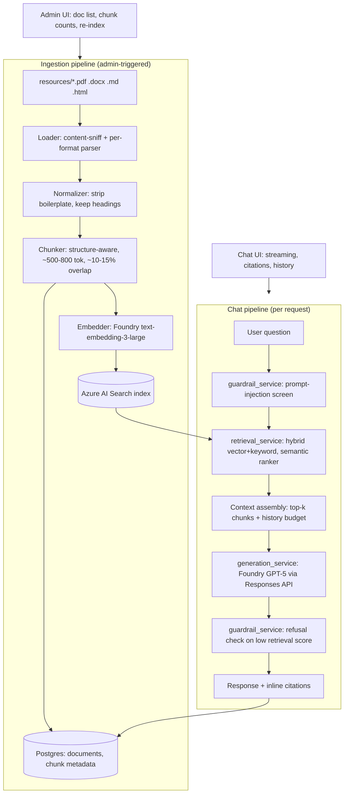
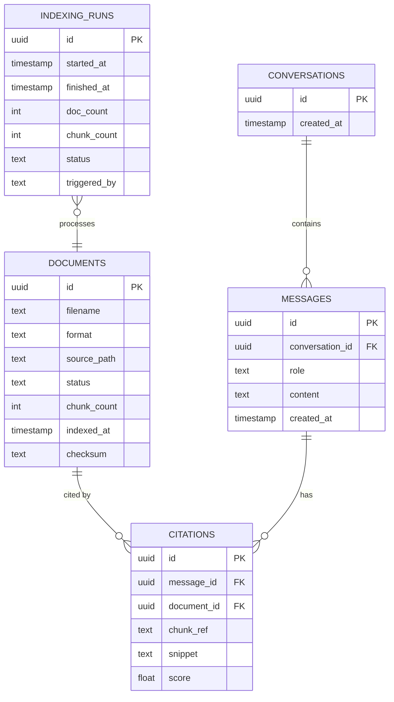

# UC1 — RAG Knowledge Chatbot: Solution Design Doc

## 1. Problem statement

Employees need quick, trustworthy answers to policy/benefits/procedure questions without
digging through a stack of PDFs, DOCX files, and wiki pages. Today those answers live
scattered across 19 source documents in 4 formats. This project builds an internal knowledge
assistant that answers questions **grounded only in that corpus** — with citations back to
the source document and section, a refusal path for out-of-scope questions, and resistance to
prompt-injection attempts — so employees get a fast, accurate, auditable answer instead of an
LLM improvising from general knowledge.

## 2. Corpus

19 documents, `uc1-RAG-Knowledge-Chatbot/backend/resources/` (kept inside the backend's Docker
build context so ingestion works in a container without a separate volume mount): 8 PDF,
4 DOCX, 4 HTML, 3 Markdown — 481 chunks total. Filenames are chosen to describe what's actually
inside the document, not just carried over from however the source published it — see the
naming audit below.

Includes `progressive-discipline-policy` and `handbook-sample.doc`, both HTML
content under a **deliberately kept** misleading extension. The ingestion loader sniffs actual
content type (`python-magic`) rather than trusting the extension, so both are correctly parsed
as HTML; confirmed by running the loader against the real corpus (all 19 files parse without
error) and covered directly by `backend/tests/test_ingestion_service.py`.

**Naming/content audit, round 1 (2026-07-20):** every corpus file was opened and read, not just
trusted by filename, after a real accuracy problem traced back to corpus composition — a
retirement question was surfacing a citation from a document about federal-employee
separation codes. That audit found two documents that had nothing to do with employee HR
policy despite being in the corpus:

- `deo_handbook.pdf` — actually the U.S. Office of Personnel Management's *Delegated
  Examining Operations Handbook*, procedures for federal hiring examiners. 322 chunks.
- `wfahandbook.pdf` — actually the U.S. Department of Transportation's *Workforce Analysis
  Handbook*, internal org-design methodology for federal agencies. 273 chunks.

Together these were **595 of the original 1,023 chunks (58%) — the majority of the entire
index — despite being completely off-topic.** Both were removed. Three more files were
misleadingly *named* (though on-topic enough to keep) and renamed to match their real content —
the DOL's FMLA guide, the DOL's general Employment Law Guide (not specifically about
progressive discipline despite its original name), and Gusto's guide on *how to write* a
handbook (not itself a company policy). One legitimately on-topic document (a real sample
handbook from Public Counsel's Community Development Project for nonprofits/small businesses)
was added to the corpus.

**Naming audit, round 2 (2026-07-20):** with 9 of 19 files touching "benefits" or "handbook" in
some way, the descriptive-but-long names from round 1 (e.g.
`employee-benefits-summary-template.docx`, `shrm-sample-employee-handbook-2023.docx`) were
still hard to visually distinguish at a glance. Shortened every filename with a consistent
prefix scheme so related documents group together and stay scannable:

| Prefix | Files | What distinguishes each |
|---|---|---|
| `benefits-` | `benefits.md`, `benefits-enrollment.pdf`, `benefits-summary.docx` | perks/insurance narrative vs. the enrollment process vs. a numbers-only summary sheet |
| `handbook-` | `handbook-nonprofit.pdf`, `handbook-sample.doc`, `handbook-indeed.pdf`, `handbook-howto-gusto.pdf`, `handbook-shrm.docx` | which source published it, or (for the Gusto one) that it teaches *how to write* a handbook rather than being one |

Everything else got a shorter single/double-word name (`attendance.pdf`, `remote-work.docx`,
`fmla-guide.pdf`, `hr-manual.docx`, `career-growth.md`, etc.). `progressive-discipline-policy`
and `handbook-sample.doc` keep their exact names deliberately — see above.

Retrieval testing deliberately includes queries against the smaller, more specific documents
too, so the index isn't validated only against the largest files (see
`retrieval-quality-note.md`).

`shrm-hr-curriculum.pdf` (SHRM's curriculum guidebook for university HR degree programs, 61
chunks) was kept in the corpus despite also not being company policy — it's lower-priority
background material, not actively wrong the way the two removed documents were, and removing it
was left as the owner's call rather than assumed.

## 3. Architecture

Two independent pipelines behind a FastAPI backend, React frontend on top.



### Backend layering

Routers (`/api/v1`) → services → repositories → external clients, following the pattern
already established in `day1-hello-world/backend` (Pydantic Settings, `.env`/`.env.example`,
`HTTPException`-based error handling, no 200-with-error-body responses).

```
routers/        chat.py, documents.py (admin), health.py
services/       ingestion_service, retrieval_service, generation_service, guardrail_service
repositories/   document_repo, conversation_repo, message_repo, citation_repo
clients/        azure_search_client, azure_foundry_client
```

### Frontend

React (Vite) + Tailwind, reusing `day1-hello-world/frontend`'s DataFactZ theme (gradient,
navy, Inter, Lucide icons). Chat view: streaming responses, citation chips linking to source
doc + section, a distinct visual state for refusals. Admin view: indexed-document table with
chunk counts and a re-index button.

## 4. Data model (Postgres, local via Docker)



`indexing_runs` backs the admin re-index button and gives an audit trail of every ingestion
run — who/what triggered it, how many docs/chunks, success/failure.

## 5. Pattern justification

Every non-trivial decision below was made against at least two named, specifically-reasoned
alternatives.

| Decision | Chosen | Rejected alternatives (why) |
|---|---|---|
| Chunking | Structure-aware — split on headings/sections, ~500-800 tokens, ~10-15% overlap | **Fixed-size 512-token windows**: ignores document structure, frequently splits mid-section, breaks citation-to-section mapping. **Semantic/embedding-based chunking**: adds embedding calls during chunking itself for marginal gain on well-structured policy docs — not worth the extra latency/cost here. |
| Retrieval | Hybrid (vector + keyword) with semantic ranker | **Pure vector search**: misses exact-term matches like policy names, section numbers, acronyms that show up verbatim in questions. **Pure keyword search**: misses paraphrased/natural-language questions that don't share vocabulary with the source doc. |
| Embedding model | `text-embedding-3-large` (Azure AI Foundry) | **`text-embedding-3-small`**: cheaper/faster but measurably lower retrieval quality on the nuanced language in HR policy text — compared head-to-head on the retrieval-quality test set (§7). **AI Search integrated vectorization**: adds a second managed-service dependency for embeddings the team can already generate directly via Foundry — no benefit once a Foundry embedding deployment exists. |
| Generation model | GPT-5 | **GPT-5.5**: no measurable quality edge over GPT-5 for this grounded-QA task, and its Foundry quota is far more constraining — 5M TPM / 5K RPM vs. GPT-5's 15M TPM / 150K RPM. The RPM gap (30x) matters most: request-count limits bind before token limits under many concurrent short chat turns, so GPT-5.5 would hit quota walls first as usage scales toward 5,000 users. **DeepSeek V3.2**: weakest quota of the three (500K TPM / 500 RPM) and requires a separate Azure AI Inference (serverless) endpoint/SDK route instead of the OpenAI-compatible one already used for embeddings — extra operational surface with no offsetting benefit for this task. |
| Relational database | Postgres, local via Docker | **Azure Database for PostgreSQL Flexible Server**: no provisioning access in the shared Resource Group. **Cosmos DB**: same access constraint, and its document model is a worse fit than Postgres's relational joins for `conversations → messages → citations`. This is a documented deviation from the "Azure-hosted" default — production path is to migrate to Azure Database for PostgreSQL Flexible Server once access is granted (see §6). |
| Follow-up question retrieval | Condense the question against history via GPT-5 before retrieval (non-streaming call, skipped on turn one) | **Retrieval on the raw current message only** (the original approach): a vague follow-up like "tell me more about that" carries no retrievable meaning by itself — measured on the real corpus, a genuine follow-up scored 1.98 on the semantic reranker (below the 2.0 refusal threshold) and was incorrectly refused, even though the prior turn in the same conversation had already retrieved the relevant chunk at 3.65. Generation never got a chance to use the history that would have resolved it, because retrieval gave up first. **Naive concatenation of full history into the retrieval query**: cheaper (no extra call) but dilutes the embedding with irrelevant earlier turns and grows unbounded with conversation length; an LLM rewrite targets just what's actually being asked. Condensing costs one extra sequential GPT-5 call per turn with history — accepted given the RPM headroom already established in §6. |

## 6. Scalability (100 → 5,000 users)

- **Generation quota is the binding constraint, not the backend.** GPT-5's Foundry quota
  (15M TPM / 150K RPM) gives real headroom: at ~1.5K tokens/turn (context + history +
  answer), 150K RPM caps out around 225M tokens/min of *request* capacity before the 15M TPM
  *token* ceiling is even reached — so RPM, not TPM, is the number to watch as concurrent
  users grow. At 5,000 users with a generous 1 turn/user/minute peak, that's 5,000 RPM — 3%
  of the 150K RPM ceiling, comfortable headroom without a quota increase request. This is
  also why GPT-5.5 (5K RPM) was rejected in §5: the same 5,000-user peak would already be at
  its limit.
- **Backend**: stateless FastAPI, async I/O throughout — horizontally scalable behind Azure
  Container Apps with autoscale as the target production topology (not deployed there today
  due to access constraints, but the code has no in-process state that would block it).
- **Retrieval**: Azure AI Search scales via replicas (query throughput) and partitions (index
  size) independently of the backend.
- **Relational data**: migrate from local Postgres to Azure Database for PostgreSQL Flexible
  Server with connection pooling (pgbouncer) once access is granted; add read replicas if
  conversation history read load grows.
- **Caching**: a Redis cache in front of `retrieval_service` for repeated/common questions
  reduces both AI Search query volume and generation calls at scale.
- **Rate limiting**: per-user request limits protect the generation budget as user count grows.
- **Cost implication**: see `cost-estimate.md` for the 100-user vs. 5,000-user comparison —
  the main cost driver at scale is generation tokens, not retrieval or storage, so caching and
  prompt/context-size discipline matter more than infrastructure sizing.

## 7. Retrieval quality note

See `retrieval-quality-note.md` — 10 real test questions against the live index, including
the discovery that the initial refusal threshold (0.55) was calibrated for the wrong score
scale, corrected to 2.0 against real in-corpus vs. out-of-corpus scores.

## 8. Cost estimate

See `cost-estimate.md` — filled in once real chunk counts and embedding/generation token
volumes are known from the ingestion run.
